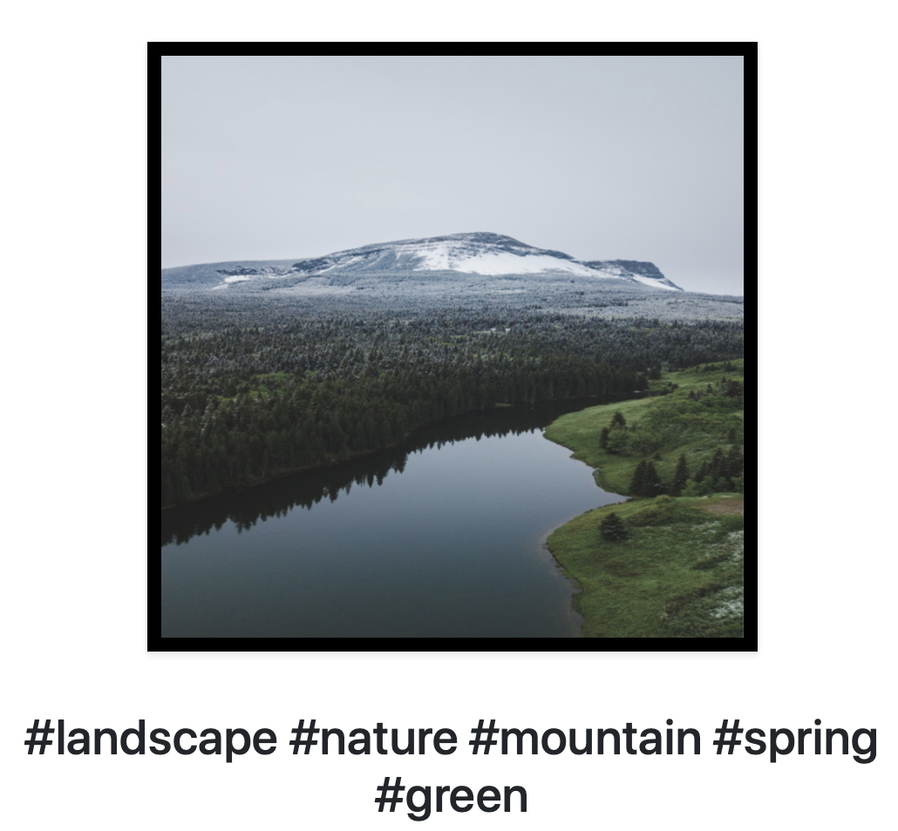
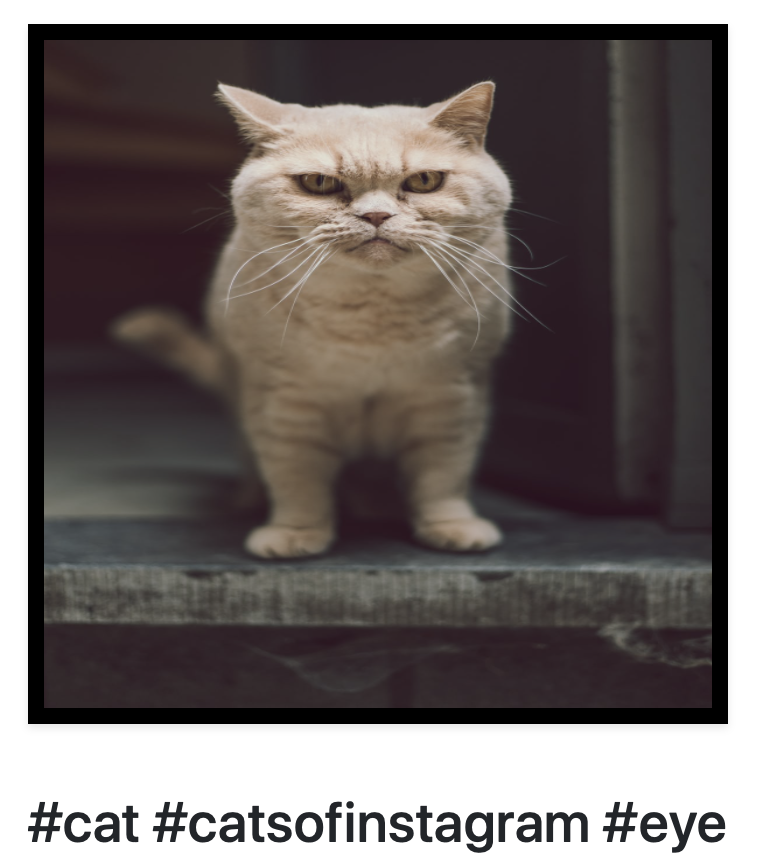
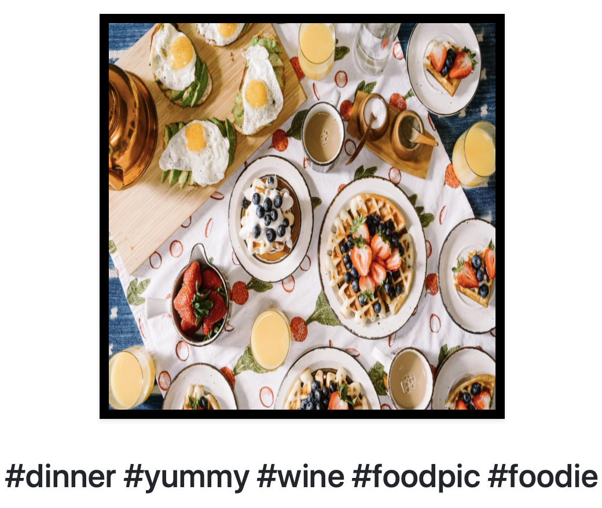
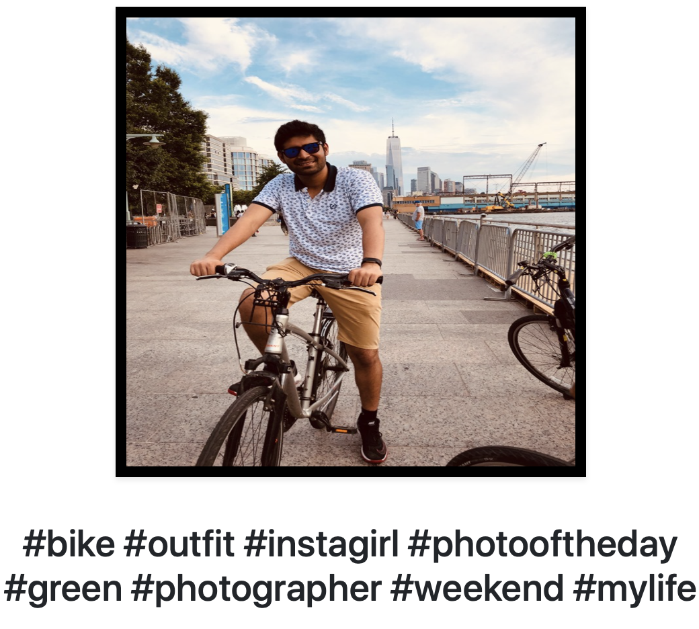
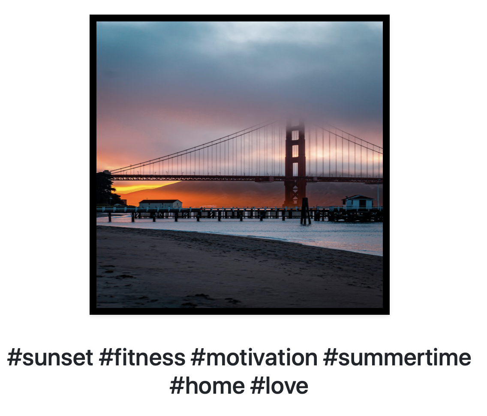

# Get-'#'

- Web application in Flask to generate hashtags automatically for an image.
- Implemented using Pytorch.
- Uses show and tell framework for image captioning.
- For more details, refer to : https://github.com/ShivamGaurUQ/Automated-hashtag-generation-using-Deep-Learning.git

# Steps to run the application:
- Download encoder and decoder (pre-trained model) and save all the files in the same directory.
- Download pre-trained pytorch model from: https://drive.google.com/drive/folders/19t8S9wuBl2XZrnJbMB7oYtFoMBtDj-8g?usp=sharing

- Run app.py.
- Application will run on local server.

# Some examples

 
 
 
 
 

